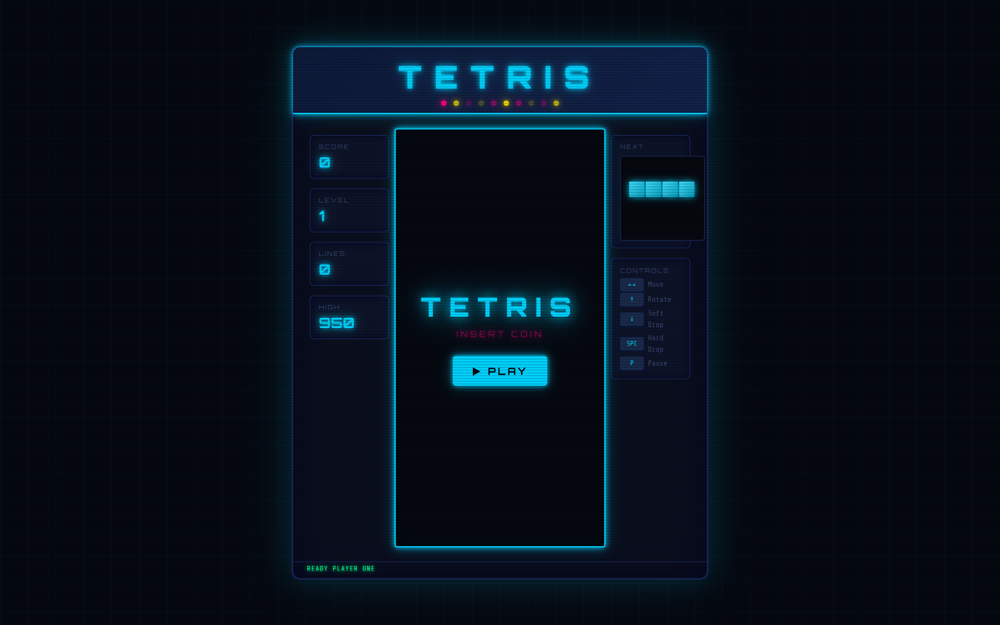
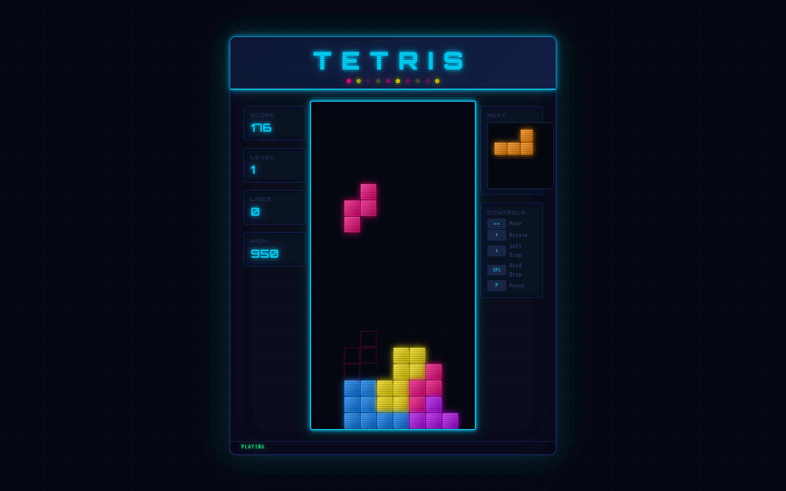
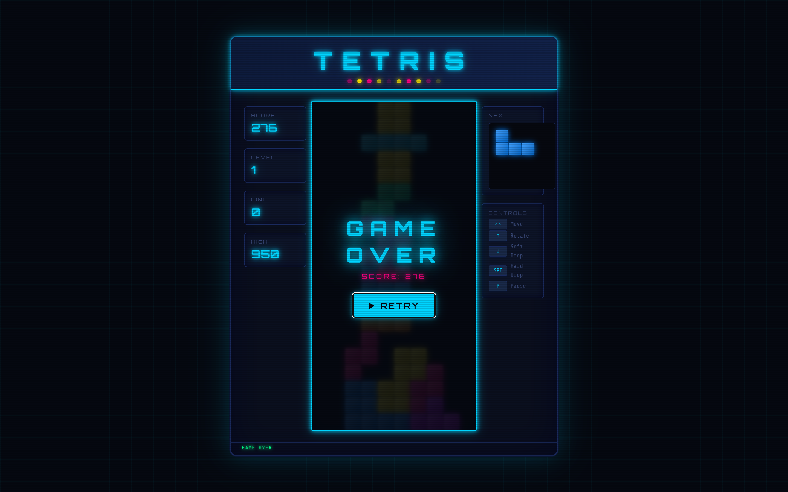

# TETRIS

A fully featured Tetris game built with vanilla HTML, CSS and JavaScript. Features a retro neon arcade cabinet aesthetic with CRT scanlines and glowing pieces.

---

## File Structure

```
tetris/
├── index.html   — Game layout and UI structure
├── style.css    — Neon arcade styling and animations
├── tetris.js    — Game logic and rendering
└── README.md    — You are here
```

---

## Getting Started

1. Download or clone the project folder
```bash
git clone https://github.com/AmmarAli12369001/Tetris
```
2. Make sure all three files (`index.html`, `style.css`, `tetris.js`) are in the **same folder**
3. Open `index.html` in a browser
4. Click **▶ PLAY** and enjoy

> An internet connection is required on first load to fetch the Google Fonts (Orbitron & Share Tech Mono). The game itself runs entirely offline.

---

## Controls

| Key | Action |
|-----|--------|
| `←` / `→` | Move piece left / right |
| `↑` | Rotate piece |
| `↓` | Soft drop (faster fall) |
| `Space` | Hard drop (instant drop) |
| `P` | Pause / Resume |

### Mobile / Touch
| Gesture | Action |
|---------|--------|
| Tap | Rotate |
| Swipe left / right | Move piece |
| Swipe down | Hard drop |

---

## Scoring

| Lines Cleared | Points (× Level) |
|---------------|------------------|
| 1 line        | 100              |
| 2 lines       | 300              |
| 3 lines       | 500              |
| 4 lines (Tetris!) | 800          |
| Hard drop     | +2 per cell      |

- Level increases every **10 lines**
- Speed increases with each level (up to level 20)
- High score is **saved automatically** in your browser (localStorage)

---

## Features

- All 7 classic tetrominoes (I, O, T, S, Z, J, L)
- Ghost piece showing where the piece will land
- Next piece preview panel
- Wall kick system for smooth rotation near edges
- CRT scanline effect and screen flicker animation
- Animated neon marquee header
- Persistent high score across sessions
- Pause / resume functionality
- Responsive, scales down on smaller screens

---

## Built With

- **HTML5 Canvas** -> game board and piece rendering
- **Vanilla JavaScript** -> all game logic, no frameworks
- **CSS3** -> animations, neon glow effects, layout
- **Google Fonts** -> Orbitron (display), Share Tech Mono (UI)

---

## Screenshots

### 1.


### 2.


### 3.

